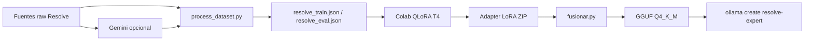

# Plantilla de proyecto — Asistente IA para DaVinci Resolve

Documento base para crear un **repositorio nuevo**, separado de **Pygenesis AI** (Unity), reutilizando el pipeline de fine-tuning que ya funciona: dataset ShareGPT → QLoRA en Colab → fusión LoRA → GGUF → Ollama.

**Nombre del repo:** `Pygenesis_ResolveExpert` (hermano de Pygenesis AI / Unity).

**Repositorio origen (copiar desde):** `Pygenesis AI` — [gitlab.com/SunoNavarro/pygenesis-ai](https://gitlab.com/SunoNavarro/pygenesis-ai)

---

## 1. Propuesta en una frase

Mismo **motor de entrenamiento** (Qwen2.5-Coder-7B-Instruct + LoRA + GGUF + Ollama), distinto **dominio** (postproducción en DaVinci Resolve) y distinto **system prompt**; proyecto en carpeta/repo propio para no contaminar el dataset ni el modelo Unity.

---

## 2. Qué reutilizar y qué no

### 2.1 Copiar casi sin cambios (infraestructura)

| Origen (Pygenesis AI) | Destino | Notas |
|----------------------|---------|--------|
| `conversion/fusionar.py` | `conversion/fusionar.py` | Cambiar solo `DEFAULT_LORA_DIRS` (p. ej. `qwen-coder-resolve-lora`) |
| `training/scripts/_training_paths.py` | igual | Genérico |
| `training/scripts/setup_env_windows.ps1` | igual | Genérico |
| `training/scripts/verify_env_windows.py` | igual | Genérico |
| `training/scripts/ollama_smoke_test.py` | igual | Cambiar nombre del modelo en el script o en `config/ollama.json` |
| `training/scripts/zip_colab_dataset.ps1` | igual | Renombrar referencias `unity_*` → `resolve_*` |
| `training/requirements-train.txt` | igual | |
| `training/requirements-train-windows.txt` | igual | |
| `training/config/paths.example.json` | igual | Copiar a `paths.json` local |
| `training/config/ollama.example.json` | igual | Modelo generador distinto del modelo final |
| `training/templates/sharegpt_example.json` | igual | Sustituir contenido de ejemplo por Resolve |
| `backend/response_filters.py` | igual | Filtro de thinking / cierres; independiente del dominio |
| `.gitignore` | igual | Quitar sección Unity/C# si no aplica; mantener `*.gguf`, `modelos/`, `.venv` |
| `guia_finetuning_pygenesis.md` | `guia_finetuning_resolve.md` | Buscar/reemplazar nombres; **las celdas Colab son las mismas** salvo rutas de JSON |

### 2.2 Copiar y adaptar (dominio Resolve)

| Origen | Destino | Cambios principales |
|--------|---------|---------------------|
| `training/scripts/_pygenesis_system.py` | `training/scripts/_resolve_system.py` | Nuevo `RESOLVE_SYSTEM`, limpieza de respuestas |
| `training/scripts/process_dataset.py` | igual | Fuentes raw, salida `resolve_train.json` / `resolve_eval.json` |
| `training/scripts/generate_qa_from_manual.py` | igual | Import `_resolve_system`; corpus `resolve`, `resolve_pdf` |
| `training/scripts/ingest_pdf_manual.py` | igual | Subcarpeta `resolve-pdf-txt` en processed |
| `training/scripts/ingest_unity_manual.py` | `ingest_resolve_manual.py` | URLs de documentación Blackmagic |
| `training/scripts/generate_synthetic.py` | igual | Temas Resolve (Edit, Color, Fusion, Fairlight, Deliver) |
| `training/scripts/run_synthetic_general.ps1` | igual | Nombres de salida |
| `training/mejorarTrainning/gemini_common.py` | igual | `GEMINI_SYSTEM_PROMPT` orientado a Resolve |
| `training/mejorarTrainning/generate_dataset_gemini.py` | igual | Lista `TEMAS` de Resolve |
| `training/mejorarTrainning/generar_conversaciones.py` | igual | Escenarios multi-turn (grading, export, Fusion) |
| `training/mejorarTrainning/mejorar_dataset_existente.py` | igual | Imports y system |
| `Modelfile` | `Modelfile` | System + `FROM ./resolve-expert-q4km.gguf` |
| `backend/main.py` | opcional | `MODEL_NAME`, system, sin `contexto_escena` Unity |
| `test_pygenesis.py` | `test_resolve.py` | Prompts de prueba Resolve |

### 2.3 Crear desde cero (específico Resolve)

| Archivo / carpeta | Propósito |
|-------------------|-----------|
| `training/config/resolve_manual_urls.txt` | URLs oficiales Blackmagic (manual, training, release notes) |
| `training/docs/ROADMAP_DATASET.md` | Fases 1a/1b/2 para Resolve |
| `training/docs/TEMAS_RESOLVE.md` | Lista curada de conceptos para sintético y Gemini |
| `Agentes/` | Roles: editor de timeline, colorista, compositor Fusion, audio Fairlight, entrega/Deliver |
| `README.md` | Visión del proyecto Resolve, no mencionar Pygenesis salvo “basado en el mismo pipeline” |

### 2.4 No copiar (específico Unity / plugin)

- `Pygenesis Plugin/`
- `Agentes/unity-*.md`
- `training/config/unity_manual_urls.txt`, `csharp_learn_urls.txt`
- `training/schemas/*` ligados al contrato JSON del plugin Unity (solo si más adelante hay plugin Resolve con API propia)
- `training/data/**` — **nunca** mezclar JSON de entrenamiento Unity con Resolve
- Pesos: `*.gguf`, `modelos/`, `qwen-unity-merged/`

---

## 3. Estructura objetivo del nuevo repo

```
ResolveExpert-AI/
├── README.md
├── Modelfile
├── guia_finetuning_resolve.md          # Colab + Ollama (clon de guia_finetuning_pygenesis.md)
├── PLANTILLA_PROYECTO_DAVINCI_RESOLVE.md   # este archivo (opcional en el nuevo repo)
├── conversion/
│   └── fusionar.py
├── backend/                            # opcional hasta tener integración (Resolve Scripting API)
│   ├── main.py
│   └── response_filters.py
├── Fases/
│   ├── fase0_preparar_entorno.md       # adaptar desde Pygenesis
│   ├── fase1_construir_dataset.md
│   ├── fase2_finetuning_hardware_actual.md
│   └── fase3_escalar_rtx3070_egpu.md
├── Agentes/
│   ├── resolve-timeline-editor.md
│   ├── resolve-colorist.md
│   ├── resolve-fusion-compositor.md
│   ├── resolve-fairlight-engineer.md
│   └── resolve-deliver-specialist.md
└── training/
    ├── README.md
    ├── requirements-train.txt
    ├── requirements-train-windows.txt
    ├── config/
    │   ├── paths.example.json
    │   ├── ollama.example.json
    │   └── resolve_manual_urls.txt
    ├── data/
    │   ├── raw/
    │   │   ├── synthetic/
    │   │   ├── gemini/
    │   │   └── pdf/                    # manuales PDF Blackmagic (licencia)
    │   ├── processed/
    │   ├── train/                      # resolve_train.json (generado, no en git)
    │   └── eval/                       # resolve_eval.json
    ├── docs/
    │   ├── ENTORNO_WINDOWS.md
    │   ├── PROCESO_ENTRENAMIENTO_COMPLETO.md
    │   └── ROADMAP_DATASET.md
    ├── mejorarTrainning/
    │   ├── gemini_common.py
    │   ├── generate_dataset_gemini.py
    │   ├── generar_conversaciones.py
    │   ├── mejorar_dataset_existente.py
    │   └── run_gemini_batch.ps1
    ├── scripts/
    │   ├── _training_paths.py
    │   ├── _resolve_system.py
    │   ├── process_dataset.py
    │   ├── ingest_resolve_manual.py
    │   ├── ingest_pdf_manual.py
    │   ├── generate_qa_from_manual.py
    │   ├── generate_synthetic.py
    │   ├── run_synthetic_general.ps1
    │   ├── zip_colab_dataset.ps1
    │   ├── setup_env_windows.ps1
    │   └── verify_env_windows.py
    └── templates/
        └── sharegpt_example.json
```

---

## 4. Bootstrap paso a paso (primera tarde)

### 4.1 Crear el repositorio

```powershell
# Carpeta hermana de Pygenesis AI (no dentro del repo Unity)
cd "C:\Users\navar\PycharmProjects"
mkdir "ResolveExpert AI"
cd "ResolveExpert AI"
git init
```

Opcional: crear repo vacío en GitLab/GitHub y `git remote add origin ...`.

### 4.2 Copiar ficheros reutilizables

Desde PowerShell (ajusta la ruta de origen):

```powershell
$SRC = "C:\Users\navar\PycharmProjects\Pygenesis AI"
$DST = "C:\Users\navar\PycharmProjects\ResolveExpert AI"

# Infraestructura
New-Item -ItemType Directory -Force -Path "$DST\conversion", "$DST\backend", "$DST\training\scripts", "$DST\training\config", "$DST\training\templates", "$DST\training\mejorarTrainning", "$DST\training\docs", "$DST\Fases", "$DST\Agentes" | Out-Null

Copy-Item "$SRC\conversion\fusionar.py" "$DST\conversion\"
Copy-Item "$SRC\backend\response_filters.py" "$DST\backend\"
Copy-Item "$SRC\.gitignore" "$DST\"
Copy-Item "$SRC\guia_finetuning_pygenesis.md" "$DST\guia_finetuning_resolve.md"
Copy-Item "$SRC\PLANTILLA_PROYECTO_DAVINCI_RESOLVE.md" "$DST\"

# training/scripts (genéricos)
@(
  "_training_paths.py", "setup_env_windows.ps1", "verify_env_windows.py",
  "zip_colab_dataset.ps1", "ollama_smoke_test.py", "ingest_pdf_manual.py"
) | ForEach-Object { Copy-Item "$SRC\training\scripts\$_" "$DST\training\scripts\" }

# training (resto)
Copy-Item "$SRC\training\requirements-train*.txt" "$DST\training\"
Copy-Item "$SRC\training\config\paths.example.json" "$DST\training\config\"
Copy-Item "$SRC\training\config\ollama.example.json" "$DST\training\config\"
Copy-Item "$SRC\training\templates\sharegpt_example.json" "$DST\training\templates\"

# Scripts a adaptar (copiar como punto de partida)
@(
  "process_dataset.py", "generate_qa_from_manual.py", "generate_synthetic.py",
  "run_synthetic_general.ps1"
) | ForEach-Object { Copy-Item "$SRC\training\scripts\$_" "$DST\training\scripts\" }

Copy-Item "$SRC\training\scripts\_pygenesis_system.py" "$DST\training\scripts\_resolve_system.py"
Copy-Item "$SRC\training\scripts\ingest_unity_manual.py" "$DST\training\scripts\ingest_resolve_manual.py"

Copy-Item "$SRC\training\mejorarTrainning\*" "$DST\training\mejorarTrainning\" -Recurse
Copy-Item "$SRC\training\docs\ENTORNO_WINDOWS.md" "$DST\training\docs\"
Copy-Item "$SRC\Fases\*" "$DST\Fases\"

# Plantilla Modelfile
Copy-Item "$SRC\Modelfile" "$DST\Modelfile"
```

### 4.3 Buscar y reemplazar (obligatorio)

En el **nuevo** repo, reemplazos globales sugeridos:

| Buscar | Reemplazar |
|--------|------------|
| `PYgenesis` / `Pygenesis` / `pygenesis` | `ResolveExpert` / `resolve-expert` (según contexto) |
| `unity_train.json` | `resolve_train.json` |
| `unity_eval.json` | `resolve_eval.json` |
| `_pygenesis_system` | `_resolve_system` |
| `PYGENESIS_SYSTEM` | `RESOLVE_SYSTEM` |
| `pygenesis-unity` | `resolve-expert` |
| `qwen-coder-unity` | `qwen-coder-resolve` |
| `Unity` / `C#` en system prompts | DaVinci Resolve / postproducción |

Herramienta: búsqueda del IDE o:

```powershell
cd "C:\Users\navar\PycharmProjects\ResolveExpert AI"
# Revisar manualmente cada fichero tras un replace masivo
```

### 4.4 System prompt unificado (entrenamiento + Ollama)

Crear en `_resolve_system.py` y alinear con `Modelfile` (mismo texto en inferencia y en cada `conversations[].from == "system"` del dataset):

```text
Eres ResolveExpert AI, asistente experto en DaVinci Resolve (edición, Color, Fusion, Fairlight y Deliver).

Responde en español salvo que pidan otro idioma. Usa JSON solo si lo piden explícitamente.
Explica pasos concretos en la interfaz de Resolve (páginas Edit, Cut, Fusion, Color, Fairlight, Deliver).
Diferencia Resolve Free vs Studio cuando importe. Si no sabes algo, dilo sin inventar.

No añadas cierres tipo "En resumen", "En conclusión" ni repitas tu rol.
```

Ajusta el tono en `Modelfile` (más mentor / más técnico) **solo si** también lo reflejas en `RESOLVE_SYSTEM` del dataset.

### 4.5 Entorno Python

```powershell
Set-Location "C:\Users\navar\PycharmProjects\ResolveExpert AI\training"
.\scripts\setup_env_windows.ps1
.\.venv\Scripts\Activate.ps1
python scripts\verify_env_windows.py
Copy-Item config\ollama.example.json config\ollama.json
```

Variable de entorno para Gemini (fase 2 del dataset):

```powershell
$env:GEMINI_API_KEY = "tu_clave"
```

---

## 5. Fuentes de datos para Resolve

### 5.1 Documentación oficial (prioridad alta)

Añadir URLs en `training/config/resolve_manual_urls.txt`. Ejemplos de familias (verificar URLs actuales en [blackmagicdesign.com](https://www.blackmagicdesign.com/products/davinciresolve)):

- DaVinci Resolve Manual (PDF/HTML)
- Training / beginner guides
- Release notes (novedades por versión)
- Fusion / Color / Fairlight sections

Flujo (igual que Unity):

```powershell
python scripts\ingest_resolve_manual.py
python scripts\generate_qa_from_manual.py --corpus resolve --max-chunks 50 --sleep 0.5
python scripts\process_dataset.py
```

### 5.2 PDFs

Manuales descargados → `training/data/raw/pdf/` → `ingest_pdf_manual.py` → `generate_qa_from_manual.py --corpus resolve_pdf`.

**Licencia:** solo material que puedas usar para entrenamiento privado o según términos Blackmagic.

### 5.3 Sintético con Ollama

Adaptar `generate_synthetic.py` con bloques de conceptos:

| Área | Ejemplos de conceptos |
|------|------------------------|
| **Edit** | timeline, ripple/roll, trim, multicam, proxies, media pool |
| **Cut** | página Cut, smart editing |
| **Color** | nodes, primaries, qualifiers, power windows, HDR, scopes, LUTs, color space |
| **Fusion** | Merge, Transform, Keyer, Tracker, planar tracking, compositing |
| **Fairlight** | buses, EQ, ducking, loudness |
| **Deliver** | codecs, H.264/H.265, ProRes, DNxHR, resolución, frame rate |
| **General** | project settings, cache, optimized media, collaboration, Resolve Studio vs Free |

### 5.4 Gemini (calidad alta, volumen medio)

Misma carpeta `training/mejorarTrainning/`:

1. Definir `TEMAS` en `generate_dataset_gemini.py` (50–80 preguntas únicas).
2. `python mejorarTrainning/generate_dataset_gemini.py`
3. Multi-turn: `generar_conversaciones.py` (p. ej. “corregir balance de color en LOG”, “exportar para YouTube”).
4. `process_dataset.py` mezcla `data/raw/gemini/*.json`.

### 5.5 Fuentes a tratar con cuidado

- Foros y Stack Overflow: útiles pero ruido y licencia heterogénea.
- Transcripciones de vídeo: solo si tienes derechos.
- Scripts de terceros: mejor generar Q&A propias que copiar código largo.

**Objetivo inicial de volumen:** 400–800 ejemplos train (comparable al primer entrenamiento Unity); ampliar en iteraciones.

---

## 6. Flujo de entrenamiento (idéntico al de Pygenesis)



| Paso | Dónde | Comando / referencia |
|------|--------|----------------------|
| Dataset final | PC | `python scripts/process_dataset.py` |
| ZIP Colab | PC | `.\scripts\zip_colab_dataset.ps1` |
| Fine-tune | Google Colab | `guia_finetuning_resolve.md` (celdas 0–8) |
| Fusión | PC | `python conversion/fusionar.py --lora-path modelos/qwen-coder-resolve-lora` |
| GGUF | PC | llama.cpp `convert_hf_to_gguf.py` + `quantize` Q4_K_M |
| Ollama | PC | `ollama create resolve-expert -f Modelfile` |
| Prueba | PC | `python test_resolve.py` o chat Ollama |

Hiperparámetros de referencia (T4, ~700 ejemplos): mismos que Unity — `r=16`, `lora_alpha=32`, 3 epochs, `max_seq_length=512`, `learning_rate=2e-4`.

---

## 7. Roadmap por fases

### Fase 0 — Entorno

- [ ] Repo nuevo, venv, Ollama, llama.cpp en `C:\llama-bin\`
- [ ] Token HuggingFace
- [ ] `guia_finetuning_resolve.md` revisada

### Fase 1a — Dataset sintético + manual

- [ ] `_resolve_system.py` + `Modelfile` alineados
- [ ] `resolve_manual_urls.txt` con al menos 10–20 URLs
- [ ] Primera pasada `generate_synthetic.py` + `process_dataset.py`
- [ ] Meta: ≥200 ejemplos train

### Fase 1b — Gemini + multi-turn

- [ ] `TEMAS` Resolve en `generate_dataset_gemini.py`
- [ ] 3–4 conversaciones multi-turn realistas
- [ ] Meta: ≥500 ejemplos train

### Fase 2 — Primer fine-tune

- [ ] Colab T4, descargar LoRA
- [ ] GGUF + `ollama create`
- [ ] Batería de pruebas en `test_resolve.py`

### Fase 3 — Iteración

- [ ] Documento comparativo Q&A (como `Preguntas_y_respuestas_comparativa.md`)
- [ ] Ajustar system prompt, temperatura, más datos en áreas débiles (p. ej. Fusion)
- [ ] Segundo entrenamiento con dataset ampliado

### Fase 4 — Integración (opcional, posterior)

- **Resolve Scripting API** (Python/Lua): backend local que envíe contexto de timeline/proyecto.
- RAG con fragmentos del manual (mismo patrón que `backend/main.py` + vectorstore).
- Plugin o panel dentro de Resolve — solo si hay producto concreto; no bloquea el fine-tune.

---

## 8. Agentes (roles para Gemini y futuro producto)

Crear un `.md` por rol en `Agentes/`, inspirados en los de Unity pero con vocabulario Resolve:

| Agente | Enfoque |
|--------|---------|
| `resolve-timeline-editor.md` | Edit/Cut, ritmo, multicam, conformado |
| `resolve-colorist.md` | grading, HDR, matching, scopes |
| `resolve-fusion-compositor.md` | nodos Fusion, VFX, tracking |
| `resolve-fairlight-engineer.md` | mezcla, loudness, limpieza de audio |
| `resolve-deliver-specialist.md` | codecs, mastering, entregables por plataforma |

Usar el contenido del agente como `system_instruction` en Gemini; el dataset guardado sigue usando `RESOLVE_SYSTEM` unificado (misma regla que Pygenesis).

---

## 9. Diferencias clave respecto a Unity

| Aspecto | Pygenesis (Unity) | ResolveExpert |
|---------|-------------------|---------------|
| Salida típica | C# / JSON plugin | Pasos UI, nodos, ajustes, export |
| APIs | Unity Engine, MonoBehaviour | Resolve Scripting API (fase posterior) |
| Manuales | docs.unity3d.com, Learn C# | Blackmagic manual / training |
| System prompt | GameObject, física, GC | páginas Resolve, color science, codecs |
| Modelo Ollama | `pygenesis-unity` | `resolve-expert` |
| Integración | Plugin Unity + backend | Por definir (scripting / panel) |

---

## 10. Checklist “listo para entrenar”

1. [ ] `resolve_train.json` y `resolve_eval.json` generados (~85% / 15%).
2. [ ] Todos los `system` en JSON = texto de `Modelfile` / `RESOLVE_SYSTEM`.
3. [ ] `colab_dataset.zip` subido a Colab.
4. [ ] GPU T4 verificada; `HF_TOKEN` en Secrets.
5. [ ] LoRA en `modelos/qwen-coder-resolve-lora/`.
6. [ ] `resolve-expert-q4km.gguf` y `ollama create` exitoso.
7. [ ] 10 preguntas de prueba manuales (Color, Fusion, Deliver) con respuestas útiles.
8. [ ] Nada de Unity en `data/raw` ni en prompts de prueba.

---

## 11. Nombres y convenciones

| Concepto | Unity (origen) | Resolve (nuevo) |
|----------|----------------|-----------------|
| Repo | Pygenesis AI | ResolveExpert AI |
| Train JSON | `unity_train.json` | `resolve_train.json` |
| Eval JSON | `unity_eval.json` | `resolve_eval.json` |
| Módulo system | `_pygenesis_system.py` | `_resolve_system.py` |
| Constante | `PYGENESIS_SYSTEM` | `RESOLVE_SYSTEM` |
| LoRA carpeta | `qwen-coder-unity-lora` | `qwen-coder-resolve-lora` |
| GGUF | `pygenesis-unity-q4km.gguf` | `resolve-expert-q4km.gguf` |
| Ollama tag | `pygenesis-unity` | `resolve-expert` |

---

## 12. Próximo paso recomendado

1. Ejecutar la sección **4.2** y crear el repo hermano.
2. Completar `_resolve_system.py`, `Modelfile` y `ingest_resolve_manual.py` con 5 URLs reales.
3. Una pasada mínima: sintético + `process_dataset.py` → primer ZIP Colab aunque el dataset sea pequeño (smoke test del pipeline).
4. Ampliar datos con Gemini antes del entrenamiento “serio”.

---

*Generado como plantilla desde el proyecto Pygenesis AI. Mantener este archivo en el nuevo repo como referencia de decisiones de arquitectura.*
